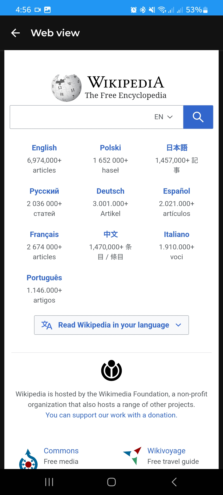

# KwikUI

A comprehensive Android UI library designed to accelerate your development process by providing pre-built, customizable UI components. Spend less time on boilerplate and more time focusing on your app's core functionality.


## Components

### Accordion
Accordion component that can be expanded or collapsed.

<table>
  <tr>
    <td></td>
    <td></td>
    <td></td>
  </tr>
</table>

```kotlin
val items = listOf(
    KwikAccordionItem("Tortuga", "A lawless island for pirates to hide and do business"),
    KwikAccordionItem("Isla de Muerta", "Can only be found by those who already know where it is"),
    KwikAccordionItem("Davy Jones' Locker", "You don't want to end up there, trust me"),
)

KwikAccordionGroup(
    items = items,
    titleProvider = { it.title },
    elevation = 2,
    errorProvider = { it.hasError },
    content = { item ->
        KwikText.BodyMedium(text = item.content, modifier = Modifier.padding(16.dp))
    }
)
```

[Accordion docs](https://isakaro.com)

---

### Bottom Tabs
Bottom tabs component that can display multiple tabs.

<table>
  <tr>
    <td></td>
    <td></td>
  </tr>
</table>

```kotlin
val navItems = listOf(
    KwikTabItem(
        title = "Home",
        icon = Icons.Rounded.Home,
        content = {
            Content("Home")
        }
    ),
    KwikTabItem(
        title = "Discover",
        icon = Icons.Rounded.LocationOn,
        content = {
            Content("Discover")
        }
    )
)

val pagerState = rememberPagerState(
    initialPage = 0,
    initialPageOffsetFraction = 0f
) {
    navItems.size
}

KwikBottomTabs(
    modifier = Modifier.height(100.dp).padding(4.dp),
    shape = MaterialTheme.shapes.large,
    elevation = 8,
    tabs = navItems,
    pagerState = pagerState
)
```

[Bottom Tabs docs](https://isakaro.com)

---

### Buttons
Easily create various button styles with customizable colors, shapes, and sizes. Supports different states like enabled, disabled, and loading.

<table>
  <tr>
    <td></td>
    <td></td>
  </tr>
</table>

```kotlin
KwikButton(
    text = "Submit",
    onClick = {
        // Handle click event
    }
)

// Loading state button
KwikButton(
    text = "Loading",
    isLoading = true
)

// Button with trailing icon
KwikButton(
    text = "Action",
    trailingIcon = Icons.AutoMirrored.Filled.ArrowForward,
    onClick = {  }
)
```

[Button docs](https://isakaro.com)

---

### Text Fields
KwikUI offers a range of text field styles to suit your needs:
- **Filled Text Fields:** Standard text fields with a filled background.
- **Outlined Text Fields:** Text fields with an outlined border.
- **OTP Fields:** Specialized text fields for collecting One-Time Passcodes (OTP). Provides features like automatic focus and input masking.

 

```kotlin
var email by remember { mutableStateOf("") }

KwikTextField(
    value = email,
    onValueChange = { email = it },
    style = KwikTextFieldStyle.Outlined,
    hint = "Email Address",
    keyboardType = KeyboardType.Email
)

// OTP Field
var otpValue by remember { mutableStateOf("") }

KwikOtpField(
    value = otpValue,
    onValueChange = { otpValue = it },
    length = 6,
    autoFocus = true
)
```

[Button docs](https://isakaro.com)

---

### Webview
Integrate web content seamlessly with the pre-configured webview. Includes features like file upload handling, native bridge communication, Javascript support, multi-window support, progress indicators, and more.


<table>
  <tr>
    <td></td>
    <video width="400" controls>
        <source src="media/webview/vid1.mp4" type="video/mp4">
        Your browser does not support the video tag.
    </video>
  </tr>
</table>

```kotlin
KwikWebview(
    url = "https://example.com"
)
```

---

### Permission Handlers
Simplify permission management with easy-to-use handlers. Request permissions with clear callbacks for granted and denied scenarios.

 

```kotlin
KwikPermissionHandler(
    permissions = listOf(Manifest.permission.CAMERA, Manifest.permission.READ_EXTERNAL_STORAGE),
    onGranted = {
        // Handle granted permissions
    },
    onDenied = {
        // Handle denied permissions
    }
)
```

---

### Radio Groups
Create and manage radio button groups effortlessly. Customize the appearance and handle selection changes with minimal code.

 

```kotlin
var selectedOption by remember { mutableStateOf("option1") }

KwikRadioGroup(
    selectedOption = selectedOption,
    onOptionSelected = { selectedOption = it },
    orientation = Orientation.Vertical
) {
    KwikRadioOption(
        value = "option1",
        text = "Option 1"
    )
    KwikRadioOption(
        value = "option2",
        text = "Option 2"
    )
    KwikRadioOption(
        value = "option3",
        text = "Option 3"
    )
}
```

---

### Rating Bars
Implement rating input with customizable rating bars. Supports different icons and sizes.

 

```kotlin
var rating by remember { mutableStateOf(3.5f) }

KwikRatingBar(
    rating = rating,
    onRatingChanged = { rating = it },
    maxRating = 5,
    iconSize = 24.dp
)
```

---

### Progress Bars
Display progress indicators with various styles and customization options, including linear and circular progress bars.

 

```kotlin
// Linear progress bar
KwikLinearProgressBar(
    progress = 0.75f,
    color = MaterialTheme.colorScheme.primary
)

// Circular progress bar
KwikCircularProgressBar(
    progress = 0.75f,
    color = MaterialTheme.colorScheme.primary,
    size = 48.dp
)

// Indeterminate progress bar
KwikLinearProgressBar(
    isIndeterminate = true
)
```

---

## All Components

KwikUI includes a comprehensive collection of components:

- **Accordion** (accordion, accordion group)
- **Appbar**
- **Avatar**
- **Biometrics**
- **Bottom Tabs**
- **Button**
- **Card**
- **Carousel** (slider)
- **Checkbox**
- **Counter**
- **Countrypicker**
- **Date Picker** (date input, date picker, date range picker)
- **Dialogs** (modals)
- **Dropdown**
- **Filter Chips**
- **Grid** (CSS-like)
- **Permission Handler**
- **Progress Bar**
- **Radio** (group)
- **Rating Bar**
- **Search View** with autocomplete and debounce capabilities
- **Sliders** (range sliders)
- **Stepper**
- **Switch**
- **Tags Input**
- **Text Fields** (filled, outlined, with suggestions feature and debounce)
- **Timeline**
- **Toast** component (modern)
- **Toggle Button**
- **Webview**

## Installation

Add KwikUI to your project by including the following in your app's `build.gradle` file:

```kotlin
dependencies {
    implementation("com.isakaro:kwikui:1.0.0")
}
```

## Documentation

For detailed documentation and more examples, visit our [official documentation](https://kwikui.dev/docs).

## License

KwikUI is available under the MIT license. See the LICENSE file for more info.