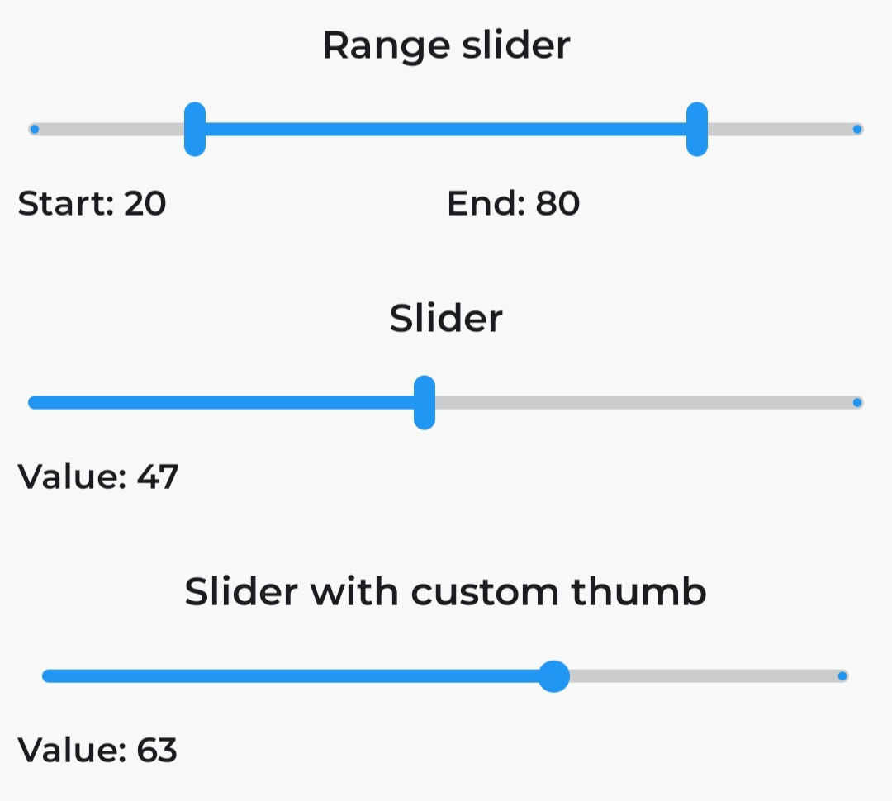
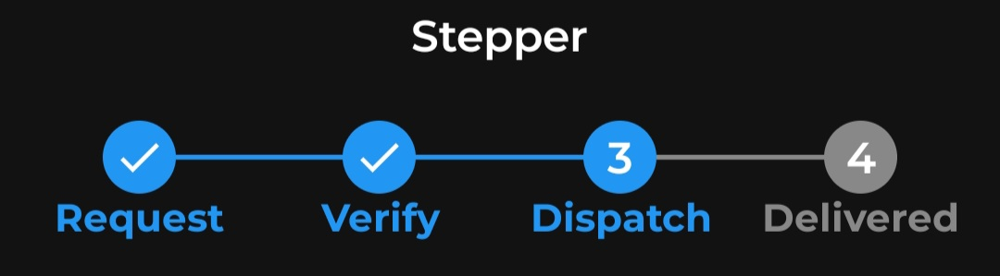

# KwikUI

A comprehensive Android UI library designed to accelerate your development process by providing pre-built, customizable UI components. Spend less time on boilerplate and more time focusing on your app's core functionality.


## All Components

KwikUI includes a comprehensive collection of components:

- **Accordion** (accordion, accordion group)
- **Biometrics**
- **Bottom Tabs**
- **Button**
- **Card**
- **Carousel** (slider)
- **Checkbox**
- **Counter**
- **Country picker**
- **Date Picker** (date input, date picker, date range picker)
- **Dialogs** (modals)
- **Dropdown**
- **Filter Chips**
- **Grid** (CSS-like)
- **Permission Handler**
- **Progress Bar**
- **Radio** (group)
- **Rating Bar**
- **Search View** with autocomplete and debounce capabilities
- **Sliders** (range sliders)
- **Stepper**
- **Switch**
- **Tags Input**
- **Text Fields** (filled, outlined with suggestions feature and debounce)
- **Timeline**
- **Toast**
- **Toggle Button**
- **Webview**

### Accordion
Accordion component that can be expanded or collapsed.


```kotlin
val items = listOf(
    KwikAccordionItem("Tortuga", "A lawless island for pirates to hide and do business"),
    KwikAccordionItem("Isla de Muerta", "Can only be found by those who already know where it is"),
    KwikAccordionItem("Davy Jones' Locker", "You don't want to end up there, trust me"),
)

KwikAccordionGroup(
    items = items,
    titleProvider = { it.title },
    elevation = 2,
    errorProvider = { it.hasError },
    content = { item ->
        KwikText.BodyMedium(text = item.content, modifier = Modifier.padding(16.dp))
    }
)
```

[Accordion docs](https://isakaro.github.io/kwik-ui-android/)

---

### Bottom Tabs
Bottom tabs component that can display multiple tabs.

<table>
  <tr>
    <td></td>
    <td></td>
  </tr>
</table>

```kotlin
val navItems = listOf(
    KwikTabItem(
        title = "Home",
        icon = Icons.Rounded.Home,
        content = {
            Content("Home")
        }
    ),
    KwikTabItem(
        title = "Discover",
        icon = Icons.Rounded.LocationOn,
        content = {
            Content("Discover")
        }
    )
)

val pagerState = rememberPagerState(
    initialPage = 0,
    initialPageOffsetFraction = 0f
) {
    navItems.size
}

KwikBottomTabs(
    modifier = Modifier.height(100.dp).padding(4.dp),
    shape = MaterialTheme.shapes.large,
    elevation = 8,
    tabs = navItems,
    pagerState = pagerState
)
```

[Bottom Tabs docs](https://isakaro.github.io/kwik-ui-android/)

---

### Buttons
Easily create various button styles with customizable colors, shapes, and sizes. Supports different states like enabled, disabled, and loading.

<table>
  <tr>
    <td></td>
    <td></td>
  </tr>
  <tr>
    <td></td>
    <td></td>
  </tr>
</table>

```kotlin
KwikButton(
    text = "Submit",
    onClick = {
        // Handle click event
    }
)

// Loading state button
KwikButton(
    text = "Loading",
    isLoading = true
)

// Button with trailing icon
KwikButton(
    text = "Action",
    trailingIcon = Icons.AutoMirrored.Filled.ArrowForward,
    onClick = {  }
)
```

[Button docs](https://isakaro.github.io/kwik-ui-android/)

---

### Cards
Cards with customizable colors, shapes, and sizes. Includes ready-to-use components such as image cards...

```kotlin
KwikCard(){
    // content
}
```

[Card docs](https://isakaro.github.io/kwik-ui-android/)

---

### Carousel (Slider)
Carousel component for displaying images or other content in a sliding format. Supports looping and autoplay features.

<table>
  <tr>
    <td></td>
    <td></td>
  </tr>
</table>

```kotlin
val carouselState = rememberKwikCarouselState(
    KwikCarouselState(
        itemCount = images.size,
        loop = true
    )
)

KwikImageCarousel(
    modifier = Modifier.height(200.dp),
    state = carouselState,
    autoPlay = true,
    images = images
)
```

[Carousel docs](https://isakaro.github.io/kwik-ui-android/)

---

### Checkbox
Checkbox component for selecting options. Supports different states like checked, unchecked, and indeterminate.


```kotlin
 var checked by remember { mutableStateOf(true) }

KwikCheckBox(
    checked = checked,
    onCheckedChange = {
        checked = it
    }
)
```

[Checkbox docs](https://isakaro.github.io/kwik-ui-android/)

### Counter
Counter component for incrementing or decrementing values. Supports different styles and sizes.

<table>
  <tr>
    <td></td>
    <td></td>
  </tr>
</table>

```kotlin
var counterState by remember { mutableStateOf(0) }

KwikCounter(
    label = "Counter",
    initialValue = 2,
    onValueChange = {
        counterState = it
    }
)
```

[Counter docs](https://isakaro.github.io/kwik-ui-android/)

---

### Country Picker
Country picker component for selecting countries. Supports search functionality and customizable appearance.

```kotlin
KwikCountryCodePicker(
    state = rememberLazyListState(),
    onSelect = {
        // handle selected country
    },
)
```
[Country Picker docs](https://isakaro.github.io/kwik-ui-android/)

---

### Date Picker
Date picker component for selecting dates. Supports different styles and formats.

<table>
  <tr>
    <td></td>
    <td></td>
  </tr>
  <tr>
    <td></td>
    <td></td>
  </tr>
</table>

## Date Picker (Input)
```kotlin
var selectedDate by remember { mutableStateOf<LocalDate?>(null) }

KwikDateFieldButton(
    label = "Date of birth",
    placeholder = "Enter your date of birth",
    mode = KwikDatePickerMode.Input,
    selected = {
        selectedDate = it
    }
)
```

## Date Picker (Picker)
```kotlin
var selectedDate by remember { mutableStateOf<LocalDate?>(null) }

KwikDateFieldButton(
    label = "Date of birth",
    placeholder = "Enter your date of birth",
    mode = KwikDatePickerMode.Picker,
    selected = {
        selectedDate = it
    }
)
```

## Date Range Picker
```kotlin
var selectedDate by remember { mutableStateOf<LocalDate?>(null) }

KwikDateFieldButton(
    label = "Date of birth",
    placeholder = "Enter your date of birth",
    mode = KwikDatePickerMode.Input,
    selected = {
        selectedDate = it
    }
)
```

[Date Picker docs](https://isakaro.github.io/kwik-ui-android/)

---

### Dialogs
Dialogs for displaying messages or prompts. Supports different styles and customizable content.

<table>
  <tr>
    <td></td>
    <td></td>
  </tr>
</table>

```kotlin
val openDialog = remember { mutableStateOf(false) }

KwikDialog.ConfirmDialog(
    open = openConfirmDialog,
    onConfirm = {
        openConfirmDialog = false
    },
    dismiss = {
        openConfirmDialog = false
    }
){
    Column(
        modifier = Modifier.padding(16.dp)
    ) {
        KwikText.TitleSmall(
            text = "The only rules that really matter are these: what a man can do and what a man can’t do.",
        )
    }
}
```

[Dialog docs](https://isakaro.github.io/kwik-ui-android/)

---

### Dropdown
Dropdown component for selecting options from a list. Supports search functionality and customizable appearance.

<table>
  <tr>
    <td></td>
    <td></td>
  </tr>
</table>

```kotlin
var selectedOption by remember { mutableStateOf("") }

val items = listOf(
    KwikDropdownItemActionState.Data(
        KwikDropdownItem(
            text = {
                KwikText.BodyMedium(text = "Profile")
            },
            leadingIcon = {
                KwikImageView(
                    url = Icons.Default.AccountCircle
                )
            },
            onClick = {
                // Handle click event
            }
        )
    )
)

KwikDropdown(
    state = state,
    onDismissRequest = { state = false },
    items = items
)
```

[Dropdown docs](https://isakaro.github.io/kwik-ui-android/)

---

### Filter Chips
Filter chips for filtering content based on selected options. Supports different styles and customizable appearance.

<table>
  <tr>
    <td></td>
    <td></td>
  </tr>
</table>

```kotlin
val filters = listOf(
    KwikFilterChipOption("Option 1", "1"),
    KwikFilterChipOption("Option 2", "2"),
    KwikFilterChipOption("Option 3", "3"),
    KwikFilterChipOption("Option 4", "4"),
    KwikFilterChipOption("Option 5", "5")
)

var selected by remember { mutableStateOf(filters) }

KwikTheme {
    KwikFilterChips(
        filters = filters,
        flowLayout = true,
        preSelection = setOf(filters.random()),
        filtersUpdated = { selected = it }
    )
}
```

[Filter Chips docs](https://isakaro.github.io/kwik-ui-android/)

---

### Grid
Grid component for displaying items in a grid layout. Supports different styles and customizable appearance.

<table>
  <tr>
    <td></td>
    <td></td>
  </tr>
</table>

```kotlin
val items = listOf(
    KwikDiv(
        colSpan = 3,
        colPosition = 0,
        rowPosition = 0,
        onClick = {},
        content = {
            KwikImageView(
                modifier = Modifier.background(color = Color.Transparent, shape = MaterialTheme.shapes.medium),
                url = KwikConstants.SAMPLE_IMAGE
            )
        }
    )
)

KwikGrid(
    modifier = Modifier.fillMaxSize().height(300.dp),
    cols = 4,
    rows = 3,
    gap = 4,
    items = items
)
```

[Grid docs](https://isakaro.github.io/kwik-ui-android/)

---

### Permission Handlers
Permission handlers for managing app permissions. Supports different styles and customizable appearance.

```kotlin
val permissionState = rememberKwikPermissionState()

KwikPermissionsRequest(
            state = permissionState.value,
            permissions = listOf(
                KwikPermissionDto(Manifest.permission.READ_MEDIA_IMAGES, "Allow app to access your photos and videos to use while creating a listing."),
                KwikPermissionDto(Manifest.permission.READ_MEDIA_VIDEO, "Allow app to access your photos and videos to use while creating a listing.")
            ),
            title = "Media access required",
            image = { // optional image to show
                KwikImageView(
                    modifier = Modifier.size(120.dp),
                    url = Icons.Default.Build,
                    tint = Color.Gray
                )
            },
            onGrantAction = { 
                // action to perform when permissions are granted
                granted = true
            },
            onDeniedAction = {
                // action to perform when permissions are denied
            },
            onCancel = {
                // action to perform when user cancels the permission request
            }
        )
```

[Permission Handlers docs](https://isakaro.github.io/kwik-ui-android/)

---

### Progress
Progress component for displaying loading indicators. Supports different styles and customizable appearance.

## Loading View with text
```kotlin
KwikLoadingView(
    text = "Loading... Please Wait..."
)
```

## Circular Loading
```kotlin
KwikCircularLoading()
```

## Linear Loading and custom track color
```kotlin
KwikLinearLoading(
    trackColor = Color.White
)
```

[Progress docs](https://isakaro.github.io/kwik-ui-android/)

---

### Radio Groups
Radio groups for selecting options. Supports different styles and customizable appearance.


```kotlin
val options = listOf(
    KwikRadioItem("Captain Jack Sparrow", 1),
    KwikRadioItem("Captain Hector Barbossa", 2),
    KwikRadioItem("Calypso", 3),
    KwikRadioItem("Davy Jones", 4),
)

val (selectedOption, onOptionSelected) = remember { mutableStateOf<KwikRadioItem<Int>?>(null) }

KwikRadioButtonGroup(
    options = options,
    onOptionSelected = {
        onOptionSelected(it)
    }
)
```

[Radio Group docs](https://isakaro.github.io/kwik-ui-android/)

---

### Rating Bars
Rating bars for displaying and selecting ratings. Supports different styles and customizable appearance.

<table>
  <tr>
    <td></td>
    <td></td>
  </tr>
</table>

```kotlin
var userRating by remember { mutableIntStateOf(0) }

KwikRatingBar(
    stars = 5,
    rating = userRating.toDouble(),
    clickable = true,
    showBadge = false,
    starSize = 60.dp,
    onClick = { rating ->
        userRating = rating
    }
)
```

[Rating Bar docs](https://isakaro.github.io/kwik-ui-android/)

---

### Search View
Search view component for searching content. Supports different styles, customizable appearance and suggestions.

<table>
  <tr>
    <td></td>
    <td></td>
  </tr>
</table>

```kotlin
val query = rememberSaveable(stateSaver = TextFieldValue.Saver) {
    mutableStateOf(
        TextFieldValue("")
    )
}

KwikSearchView(
    state = query,
    placeholder = "Enter address...",
    onTextChange = { query ->

    },
    suggestions = listOf("Tortuga", "Isla de Muerta", "Shipwreck Cove", "Davy Jones' Locker")
)
```

[Search View docs](https://isakaro.github.io/kwik-ui-android/)

---

### Sliders
Sliders for selecting values within a range. Supports different styles and customizable appearance.

<table>
  <tr>
    <td></td>
    <td></td>
  </tr>
</table>

## Range slider
```kotlin
var sliderPosition by remember { mutableStateOf(20f..80f) }

KwikRangeSlider(
    value = sliderPosition,
    onValueChange = { range ->
        sliderPosition = range
    }
)
```

## Single slider
```kotlin
var sliderPosition by remember { mutableFloatStateOf(0f) }

KwikSlider(
    value = sliderPosition,
    onValueChange = { range ->
        sliderPosition = range
    }
)
```

[Slider docs](https://isakaro.github.io/kwik-ui-android/)

---

### Stepper
Stepper component for incrementing or decrementing values. Supports different styles and customizable appearance.

<table>
  <tr>
    <td></td>
    <td></td>
  </tr>
  <tr>
    <td></td>
    <td></td>
  </tr>
</table>

```kotlin
val kwikStepperState = rememberKwikStepperState(
    steps = listOf("Request", "Verify", "Dispatch", "Delivered")
)

KwikStepper(
    state = kwikStepperState
)
```

## Controlling the Stepper
```kotlin
kwikStepperState.moveForward() // Move to the next step

kwikStepperState.moveBackward() // Move to the next step

kwikStepperState.completeAll() // Move to the next step

kwikStepperState.clearAll() // Move to the next step

kwikStepperState.moveToStep() // Move to a specific step
```

[Stepper docs](https://isakaro.github.io/kwik-ui-android/)

---

### Switch
Switch component for toggling between two states. Supports different styles and customizable appearance.


```kotlin
val checkedState = remember { mutableStateOf(true) }

KwikSwitch(
    text = { KwikText.BodyMedium(text = "Control the lights") },
    checked = checkedState.value,
    onCheckedChange = { checkedState.value = it }
)
```

[Switch docs](https://isakaro.github.io/kwik-ui-android/)

---

### Tabs
Tabs component for displaying multiple tabs. Supports different styles and customizable appearance.

<table>
  <tr>
    <td></td>
    <td></td>
  </tr>
</table>

```kotlin
 val tabs = listOf(
        KwikTabItem(
            title = "Muraho",
            counter = 3
        ){
            Content(text = "Muraho")
        },
        KwikTabItem(
            title = "Hello",
        ){
            Content(text = "Hello")
        },
        KwikTabItem(
            title = "Jambo",
            counter = 1
        ){
            Content(text = "Jambo")
        }
    )

KwikHorizontalTab(
    tabs = tabs,
    pagerState = pagerState
)
```

[Tabs docs](https://isakaro.github.io/kwik-ui-android/)

---

### Tags Input
Tags input component for entering multiple tags. Supports different styles and customizable appearance.

<table>
  <tr>
    <td></td>
    <td></td>
  </tr>
</table>

```kotlin
val tags = remember {
            listOf(
                KwikTagsInputItem("1", "Tortuga"),
                KwikTagsInputItem("2", "Shipwreck Cove"),
                KwikTagsInputItem("3", "Davy Jones' Locker"),
                KwikTagsInputItem("4", "Port Royal"),
                KwikTagsInputItem("5", "Isla de Muerta"),
                KwikTagsInputItem("6", "Fountain of Youth")
            )
        }

var currentTags by remember { mutableStateOf<List<KwikTagsInputItem>>(emptyList()) }

KwikTagsInput(
    items = sampleTags,
    placeholder = "Enter or select your destination",
    withQuantity = true,
    onTagsChanged = { newTags ->
        currentTags = newTags
    }
)
```

[Tags Input docs](https://isakaro.github.io/kwik-ui-android/)

---

### Text fields (Text input)
KwikUI provides a variety of text field styles to suit your needs:
- **Filled Text Fields:** Standard text fields with a filled background.
- **OTP Fields:** Specialized text fields for collecting One-Time Passcodes (OTP). Provides features like automatic focus and input masking.
- **Phone Number Fields:** Text fields specifically designed for entering phone numbers, with formatting and validation.
- **Outlined Text Fields:** Text fields with an outlined border.
- **Text Input with Suggestions:** Text fields that provide suggestions as the user types, with debounce functionality to optimize performance.
- **Text Input with Debounce:** Text fields that delay the input processing until the user stops typing for a specified duration.
- **Text Input with Suggestions and Debounce:** A combination of both features for optimal performance and user experience.
- **Text Input with Leading Icon:** Text fields that include a leading icon for added context or branding.

<table>
  <tr>
    <td></td>
    <td></td>
  </tr>
  <tr>
    <td></td>
    <td></td>
  </tr>
  <tr>
    <td></td>
    <td></td>
  </tr>
</table>

## Standard Text Field
```kotlin
val username = rememberSaveable(stateSaver = TextFieldValue.Saver) { mutableStateOf(TextFieldValue("")) }

KwikTextField(
    value = username,
    onValueChange = {
        username.value = it 
    },
    label = "Username",
    placeholder = "Enter email or phone",
    maxLength = 35,
    imeAction = ImeAction.Done,
    keyboardType = KeyboardType.Text,
    onKeyboardDone = {
        // Handle keyboard done action
    }
)
```

## Password Text Field
```kotlin
val password = rememberSaveable(stateSaver = TextFieldValue.Saver) { mutableStateOf(TextFieldValue("")) }

KwikTextField(
    value = password,
    onValueChange = {
        password.value = it 
    },
    label = "Password",
    placeholder = "Enter password",
    imeAction = ImeAction.Done,
    keyboardType = KeyboardType.Password,
    visualTransformation = PasswordVisualTransformation(),
    onKeyboardDone = {
        // Handle keyboard done action
    }
)
```

## Text Field with Suggestions
```kotlin
 val text = rememberSaveable(stateSaver = TextFieldValue.Saver) {
    mutableStateOf(
        TextFieldValue("")
    )
}

KwikTextField(
    value = text,
    onValueChange = {
        text.value = it
    },
    label = "Address",
    showClearTextButton = true,
    placeholder = "Enter address",
    suggestions = listOf("Tortuga", "Isla de Muerta", "Shipwreck Cove", "Davy Jones' Locker"),
    error = "Incorrect address",
)
```

## OTP Field
```kotlin
var otp = remember { mutableStateOf("") }

KwikOTP(
    onValidOTP = {
        otp = it
    },
    error = "Invalid OTP",
)
```

## Phone Number Field
```kotlin
val phoneNumber = rememberSaveable(stateSaver = TextFieldValue.Saver) {
    mutableStateOf(
        TextFieldValue("")
    )
}
var isPhoneNumberValid by remember { mutableStateOf(false) }

KwikPhoneNumberField(
    initialCountryInfo = countryList.random(),
    value = phoneNumber,
    label = "Phone number",
    isValid = isPhoneNumberValid,
    onValueChange = {
        phoneNumber.value = it
        // Validate phone number
    },
    onCountrySelected = { country ->
        // Handle country selection
    }
)
```

[Text field docs](https://isakaro.github.io/kwik-ui-android/)

---

### Text view

## With body medium
```kotlin
KwikText.BodyMedium(
    text = "I'm headed for Tortuga, the place where the pirates are"
)
```

## With custom text color
```kotlin
KwikText.RenderText(
    text = (stepIndex + 1).toString(),
    color = Color.White,
    style = if (stepsCount > 5) MaterialTheme.typography.bodySmall else MaterialTheme.typography.titleMedium
)
```

## Expandable text
```kotlin
KwikExpandableText(
    text = "This is the day you will always remember as the day you almost caught Captain Jack Sparrow!.",
    readMoreText = "Read more",
    showLessText = "Show less",
    maxLines = 3
)
```

---

### Timeline
Timeline component for displaying events in a chronological order. Supports different styles and customizable appearance.

<table>
  <tr>
    <td></td>
    <td></td>
  </tr>
</table>

```kotlin
val timelineEntries = listOf(
    KwikTimelineEntry(
        content = {
            // Content for the entry
        }
    ),
    KwikTimelineEntry(
        id = 0,
        title = "The Curse of the Black Pearl (2003)",
        description = "Captain Jack Sparrow teams up with Will Turner to save Elizabeth Swann from cursed pirates.",
        onClick = {
            // Handle click event
        },
        content = {
            // optional content
        }
    )
)

 KwikVerticalTimeline(
    entries = timelineEntries,
    clickable = true,
    currentStepIndex = completedIndex,
    modifier = Modifier.padding(6.dp),
    onClick = {
        // Handle click event
    }
)
```

[Timeline docs](https://isakaro.github.io/kwik-ui-android/)

---

### Toast
Toast component for displaying brief messages to the user. Supports different styles and customizable appearance.

<table>
  <tr>
    <td></td>
    <td></td>
  </tr>
</table>

```kotlin
val kwikToastState = rememberKwikToastState()

KwikToast(state = kwikToastState)
```

```kotlin
// show toast
kwikToastState.showToast("I am a toast")
```

## With custom background color
```kotlin
// show toast
kwikToastState.showToast("No biometrics set", backgroundColor = KwikColorError)
```

## With style
```kotlin
kwikToastState.showToast("Verified successfully", type = KwikToastType.SUCCESS)
```

[Toast docs](https://isakaro.github.io/kwik-ui-android/)

---

### Toggle Button
Toggle button component for toggling between two states. Supports different styles and customizable appearance.

<table>
  <tr>
    <td></td>
    <td></td>
  </tr>
</table>

```kotlin
val (value, onValueChange) = remember { mutableStateOf("") }

KwikToggleGroup(
    options = listOf(
        KwikToggleGroupOption("Tortuga", "Tortuga"),
        KwikToggleGroupOption("Fountain of Youth", "Fountain of Youth"),
        KwikToggleGroupOption("Port Royal", "Port Royal")
    ),
    selectedOption = 2,
    onOptionSelected = {
        onValueChange(it.toString())
    }
)
```

### Typography
KwikUI provides a variety of typography styles to suit your needs:
- **Display (Small, Medium, Large):** Display text styles in small, medium, and large sizes.
- **Headline (Small, Medium, Large):** Headline text styles in small, medium, and large sizes.
- **Title (Small, Medium, Large):** Title text styles in small, medium, and large sizes.
- **Body (Small, Medium, Large):** Body text styles in small, medium, and large sizes.
- **Label (Small, Medium, Large):** Label text styles in small, medium, and large sizes.
- **Quote:** Quote text style for displaying quotes or important messages.

<table>
  <tr>
    <td></td>
    <td></td>
  </tr>
</table>

---

### Webview
Integrate web content seamlessly with the pre-configured webview. Includes features like file upload handling, native bridge communication, Javascript support, multi-window support, progress indicators, and more.


```kotlin
KwikWebview(
    url = "https://google.com"
)
```

---

## Installation

Add KwikUI to your project by including the following in your app's `build.gradle` file:

```kotlin
dependencies {
    implementation("com.isakaro:kwik.ui:1.0.0")
}
```

## Documentation

For detailed documentation and more examples, visit our [official documentation](https://isakaro.github.io/kwik-ui-android/).

## License

KwikUI is available under the MIT license. See the LICENSE file for more info.